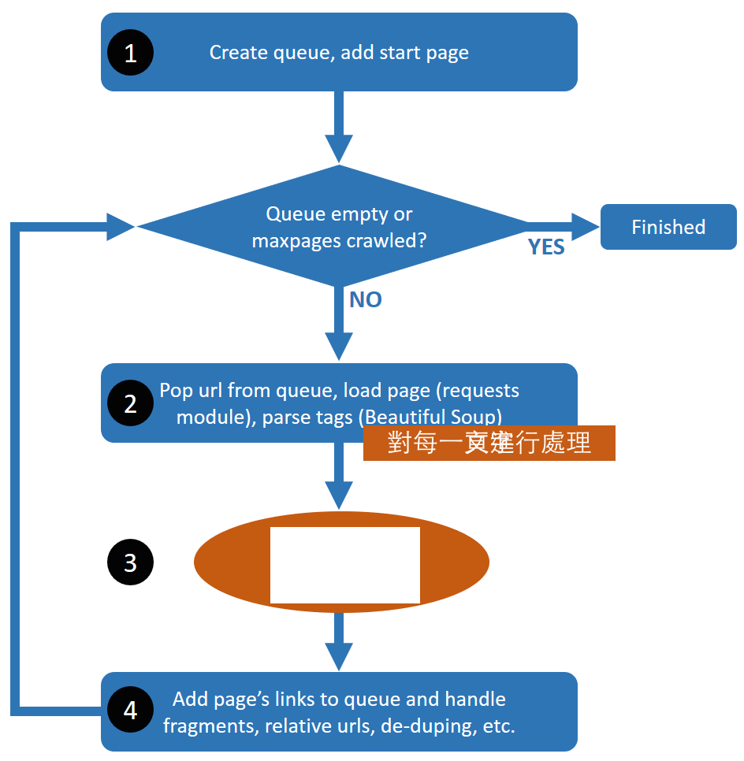

<properties LandingPageTags="Python,webscraping,webcrawling" />
# crawlerino - 一個簡單的 Python 3 網頁爬蟲　
Crawlerino 是一個python 3 的網頁爬蟲，它的設計理念是方便的讓你客制化來完成各種可能需要網頁爬蟲的任務
因此，要注意，它被設計成”容易維護及擴充”，而不是”高效”　

以下說明crawlerino不處理什麼:

* 它不處理架構的問題
* It doesn't spoof headers. Again, easy to add via requests if desired.
* 它忽略robots.txt.
cd 
它使用 ```requests``` 及 ```Beautiful Soup (bs4)```組件，讓程式碼看上去更清爽


## 安裝
crawlenino 並沒有包裝成python組件，不過，不引響你使用它，它只依賴了兩個組件，所以你大可自已安裝它們，當然python 3.x是必要的，再來你只要按照正常方式安裝requests及Beautiful即可

```
c:\myfolder> pip install requests
c:\myfolder> pip install beautifulsoup4
```
接下來你只要執行以下指令```python crawlerino.py```, 接下來你就會看到輸出結果如下圖所示:


## Customization
As it stands, crawlerino simply crawls the links on pages and it doesn't do anything with the content it finds. To add your custom processing, insert code at **step 3** in the diagram below (line 38 in the source code). There you have access to the current page as either ```response``` (from requests.get) or ```soup``` (the parsed version from Beautiful Soup).

In some cases, you may also want to customize the rules for recursively scanning links, to ignore certain types of links or destination, add authentication, enforce robots.txt, and so on. This is **step 4** in the diagram below (lines 42-50 in the source code). The basic concept there is that ```links``` is a list of the links from the current page that should be added to the crawling queue, and you can edit the content of ```links``` as desired before it gets added to the queue in line 55.



For more information about the approach taken, see the blog post [Crawling the web with Python 3.x](http://mahugh.com/2015/12/12/crawling-the-web-with-python-3-x/).
